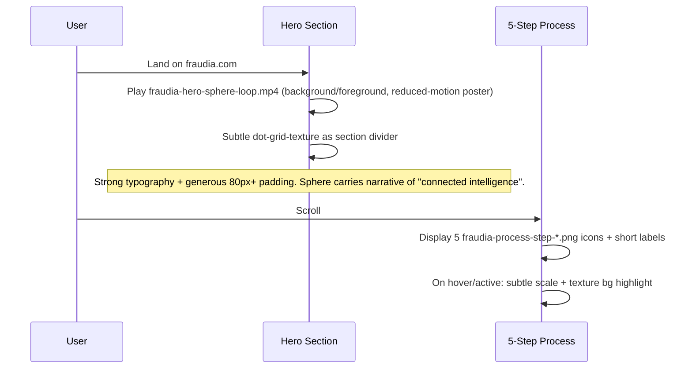
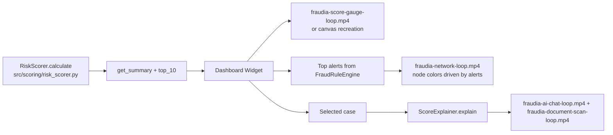

# Fraudia Visual Asset Pack Design Document

**Title**: Professional Visual Asset Pack for Fraudia Corporate Insurance Fraud Detection Web Application  
**Author**: Systems Architect (Grok-assisted)  
**Date**: 2026-05-27  
**Status**: Draft  
**Branch Context**: feature/FA-2-Arquitectura  
**Related**: README.md (risk scoring table + Strategy architecture), src/scoring/*, src/rules/*, src/explainability/*, src/app/main.py (stub), src/ai_agent/claims_agent.py (stub)

---

## Overview

This design document specifies the complete generation and integration of a 12-asset professional visual pack (7 static PNG icons/textures + 5 seamless-loop MP4 animations) for Fraudia, the rebranded corporate insurance fraud detection platform evolving from the current fraudIA Python prototype.

The assets establish a premium, Awwwards-tier visual language for both a future public marketing site and the internal analyst dashboard. All assets strictly adhere to a constrained corporate palette (Navy #1E3A5F, White #FFFFFF, Red #C0392B, Yellow #F39C12, Green #27AE60), pure white #FFFFFF backgrounds, zero text/numbers/people/neon, and exact alignment with the existing risk scoring model (0-40 Bajo/green, 41-75 Medio/yellow, 76-100 Alto/red) defined in `src/scoring/scoring_strategies.py:52-58` (HybridScoringStrategy.get_risk_level and identical logic in RulesOnly/MLOnly variants) and `src/scoring/risk_scorer.py:21-22`.

The pack directly supports key flows:
- Hero + process stepper on marketing site (5 process steps map to document ingestion → rule+ML scoring in FraudRuleEngine + RiskScorer).
- Dashboard widgets (SCORE GAUGE mirrors RiskScorer + get_summary, NETWORK visualizes rule alerts from `src/rules/fraud_rules.py:58`, DOCUMENT SCAN + AI CHAT for the planned conversational claims agent in `src/ai_agent/claims_agent.py` and explainability in `src/explainability/explanation_strategies.py`).

Assets are the first major visual deliverable on the path from the current Strategy-pattern backend prototype (12,500 synthetic siniestros in `data/synthetic/`, no frontend yet) to a production SaaS web product.

---

## Background & Motivation

The current repository (fraudIA) implements a robust, heavily Strategy-pattern backend (README.md lines 36-45 documents the four Strategy modules: rules/, models/, scoring/, explainability/). Core classes include:
- `FraudRuleEngine` (`src/rules/fraud_rules.py:19`) aggregating 10 concrete RuleStrategy implementations (BorderProximityRule, LateReportingRule, ClaimFrequencyRule, RestrictedProviderRule, DocumentAnomalyRule, AmountAnomalyRule, NarrativeSimilarityRule, PtxrbCoverageRule, MoraAseguradoRule, LowClientScoreRule).
- `RiskScorer` + three ScoringStrategy subclasses (`src/scoring/scoring_strategies.py:21-104`) producing `score_final` (0-100 clipped int) and `nivel_riesgo` ("Bajo"/"Medio"/"Alto") using exact thresholds 40/75.
- `ScoreExplainer` + three ExplanationStrategy variants (`src/explainability/explain_score.py:18` and `explanation_strategies.py`).

However, `src/app/main.py` and `src/ai_agent/claims_agent.py` are empty 0-byte stubs (confirmed via file system inspection). `docs/*.md` (except README) and `presentation/` (only .gitkeep) are empty. Visual output is limited to matplotlib evaluation charts in `reports/` (confusion matrices, feature importance, ROC/PR curves). No design system, no brand assets, no web UI.

**Pain points**:
- Executive presentations and future sales/marketing lack premium visuals aligned to the sophisticated backend (risk zones already use 🟢🟡🔴 in README).
- Internal analyst tools (future dashboard) will need high-quality, on-brand illustrations for process visualization, risk gauge, AI interaction states, and document review without resorting to generic stock or consumer-grade icons.
- Rebrand from "fraudIA" to "Fraudia" requires cohesive corporate identity starting with foundational assets.
- Existing risk model (HybridScoringStrategy default weights 0.4 rules / 0.6 ML, normalization `/70.0 * 100`) is ready for visual mapping but has no corresponding motion or iconography.

The asset pack solves this by providing production-grade, constraint-enforced visuals that can be generated immediately via the available `image_gen` and `video_gen` tools and integrated into upcoming web layers (Streamlit primary for analyst MVP per Key Decision 9; full Next.js for marketing site deferred to later epic).

---

## Goals & Non-Goals

**Goals**:
- Deliver exactly 12 assets matching the EXACT ASSET REQUIREMENTS (7 PNG + 5 MP4 seamless loops) with zero deviation on palette, backgrounds, no-text, no-people rules.
- Provide copy-paste ready, hyper-detailed prompts for `image_gen` (PNG) and `video_gen` (MP4) that an operator can execute today.
- Define concrete folder structure, naming (`fraudia-*-*.png/mp4`), optimization pipeline, versioning, and manifest.
- Specify integration architecture and usage patterns for both marketing site and internal dashboard, with direct references to existing classes (`RiskScorer.get_summary`, `FraudRuleEngine.evaluate`, `ScoreExplainer.explain`).
- Cover production concerns: CDN, accessibility, reduced-motion, asset loading, future dark-mode handling.
- Produce actionable PR plan for a small team.

**Non-Goals**:
- Actual generation or committing of binary asset files (prompts only; operator executes).
- Full frontend implementation or component library code (design + interface specs only).
- Changes to Python backend risk logic, data models, or Strategy classes.
- Support for dark backgrounds or neon/consumer aesthetics on the assets themselves.
- Dark mode variants of the assets (forbidden by constraints; UI chrome may adapt).
- Generic stock-photo style or any human figures.
- Immediate migration of existing `reports/*.png` matplotlib charts.

---

## Proposed Design

### Asset Inventory (Exact 12)

**Static PNGs (pure #FFFFFF background, Navy #1E3A5F primary)**:
1. `fraudia-shield-icon.png` — Bold shield + eye symbol.
2. `fraudia-process-step-1-document-upload.png` — Document + upload arrow.
3. `fraudia-process-step-2-brain-circuit.png` — Brain + circuit lines.
4. `fraudia-process-step-3-speedometer-needle.png` — Speedometer needle.
5. `fraudia-process-step-4-bell-alert.png` — Bell + alert dot.
6. `fraudia-process-step-5-shield-check.png` — Shield + checkmark.
7. `fraudia-dot-grid-texture.png` — Subtle 5% opacity navy dot grid, tileable.

**Seamless MP4 Loops (4-8s cycles, perfect first-frame = last-frame match, #FFFFFF bg)**:
8. `fraudia-hero-sphere-loop.mp4` — Glowing blue abstract sphere of floating docs + shields + lines. Slow 360° rotation. Premium corporate.
9. `fraudia-network-loop.mp4` — Interconnected nodes (red #C0392B / yellow #F39C12 / green #27AE60) with pulsing + animated lines. Represents fraud network / alerts.
10. `fraudia-score-gauge-loop.mp4` — Semicircular speedometer. Needle animates green (≤40) → yellow (41-75) → red (≥76) → back smoothly. Zero text.
11. `fraudia-document-scan-loop.mp4` — Document + magnifying glass scanning top-to-bottom. Dynamic green checks + red Xs on fields. Seamless restart.
12. `fraudia-ai-chat-loop.mp4` — Minimal chat bubble with brain icon. Abstract "typing" (letter-by-letter geometric marks or cursor). Small bar chart animates. Clean reset. (Abstract bars only; no readable text.)

### High-Level Architecture Diagram (Mermaid)

```mermaid
graph TD
    subgraph "Generation Layer"
        A[Operator runs image_gen / video_gen<br/>with prompts from this doc] --> B[12 assets produced]
    end

    subgraph "Asset System v1"
        B --> C[fraudia-assets/v1/{png,mp4,svg,posters}/<br/>fraudia-*.{png,mp4}<br/>manifest.json]
        C --> D[Optimization: Pillow + ffmpeg-python + pngquant (Python primary)<br/>or sharp (secondary when Next.js added)]
    end

    subgraph "Future Web Layers"
        E[Marketing Site (future epic, Next.js optional)] --> F[Hero: sphere video + Process Stepper]
        G[Internal Analyst Dashboard (PRIMARY: Streamlit + custom components)<br/>Marketing deferred] --> H[Widgets:<br/>RiskScorer.get_summary → Score Gauge (one MP4 + PNG icon)<br/>FraudRuleEngine alerts → future Network<br/>ScoreExplainer → future AI Chat integration]
    end

    subgraph "Backend Alignment (Current)"
        I[RiskScorer + HybridScoringStrategy<br/>thresholds 40/75<br/>src/scoring/scoring_strategies.py] --> G
        J[FraudRuleEngine + 10 RuleStrategies<br/>src/rules/fraud_rules.py] --> G
        K[ScoreExplainer + Detailed/Brief/Summary<br/>src/explainability/] --> G
    end

    D --> E & G
```

### Integration Points (Concrete)

1. **Risk Scoring Visuals** (`fraudia-score-gauge-loop.mp4`, `fraudia-shield-icon.png`):  
   Consume `RiskScorer.get_risk_level(score)` and `get_summary()` dict (bajo/medio/alto counts, top_10 with `id_siniestro`, `score_final`, `nivel_riesgo`). Gauge needle zones exactly mirror the three if-branches in `scoring_strategies.py:52-58`.

2. **Alert / Network Viz** (`fraudia-network-loop.mp4`):  
   Drive node colors and pulse intensity from `FraudRuleEngine.evaluate` → `alerts` list (rule names + scores from the 10 strategies; assignment at fraud_rules.py:59). Red nodes = high-severity rules (e.g. RestrictedProviderRule +10, NarrativeSimilarityRule +8).

3. **Process Stepper** (5 process PNGs):  
   Map directly to pipeline + UI flow: 1=Document ingestion (`src/ingestion/generate_documentos.py`, `DocumentAnomalyRule`), 2=Feature + Model analysis (`src/features/build_features.py` + FraudModel), 3=Scoring (`RiskScorer`), 4=Alerts/Explain (`FraudRuleEngine` + `ScoreExplainer`), 5=Decision/Shield.

4. **AI Conversational** (`fraudia-ai-chat-loop.mp4`, `fraudia-process-step-2-brain-circuit.png`):  
   Planned `src/ai_agent/claims_agent.py` + future UI. Animation represents typing + insight (bar chart = explanation confidence or feature contribution).

5. **Texture**: Subtle background on cards, modals, or full-bleed sections (marketing + dashboard). 5% opacity ensures it never competes with data tables or forms.

### Component Interface Sketch (Streamlit Primary for MVP)

```python
# Proposed (src/web/assets.py - Streamlit primary)
import streamlit as st
from pathlib import Path
import json

ASSETS_ROOT = Path(__file__).parent.parent / "fraudia-assets" / "v1"

def fraudia_asset(name: str, variant: str = "png", autoplay: bool = False,
                  reduced_motion: bool = None, aria_label: str = None):
    """Streamlit wrapper. Motion OFF BY DEFAULT on internal surfaces."""
    if reduced_motion is None:
        reduced_motion = st.get_option("theme") or True  # or check st.session_state
    path = ASSETS_ROOT / ("png" if variant == "png" else "mp4") / f"fraudia-{name}.{variant}"
    if not path.exists():
        st.error(f"Missing asset: {path}")
        return
    if variant == "mp4":
        if reduced_motion or not autoplay:
            poster = ASSETS_ROOT / "posters" / f"fraudia-{name}-poster.png"
            st.image(str(poster) if poster.exists() else str(path.with_suffix('.png')), caption=aria_label or "Decorative asset (motion disabled)")
        else:
            st.video(str(path), start_time=0, loop=True)  # muted implied via browser policy
    else:
        st.image(str(path), width=96, caption=aria_label)

# Usage in dashboard (motion explicitly off for analyst surfaces)
fraudia_asset("score-gauge-loop", variant="mp4", autoplay=False, aria_label="Risk score gauge")
fraudia_asset("shield-icon", variant="png")
```

**React shim (for future marketing site only):**
```ts
interface FraudiaAssetProps { /* same as before */ }
<FraudiaAsset name="score-gauge-loop" variant="mp4" autoplay={false} />
```

**Explicit rule (see Key Decision 7 and Risks):** Motion (autoplay loops) is **OFF BY DEFAULT** on any internal/analyst dashboard surface. Autoplay permitted only for marketing hero (public, low-cognitive-load context) with user controls and reduced-motion media query respected.

Static PNGs preferred for icons (or SVG); MP4 for hero/process emphasis areas. All internal uses default to poster/static fallback.

### Asset Storage & Delivery

**Recommendation (Python-first reality):** Do **not** commit the 5 MP4 binaries directly to the main git repo (even with LFS). Primary delivery mechanism:

- **External CDN** (preferred for this repo): Vercel Blob, Cloudinary, or AWS S3 + CloudFront. Manifest URLs point to CDN. Simple `requests` or browser fetch in Streamlit.
- **Git LFS fallback**: Only if the team has LFS configured and CI support; still enforce hard size budgets below.

**Hard size budgets (enforced in validate-assets.py + CI):**
- Each MP4 loop: **≤ 1.6 MiB** after optimization (achievable at 1280×720 @ 24 fps, H.264 CRF 28, fast preset, 2-3s loops where possible).
- Each PNG icon: ≤ 80 KiB (1024² with pngquant --quality 80-95).
- Texture: ≤ 120 KiB.
- Total pack (v1): target < 10 MiB uncompressed for easy CDN transfer.

**Python-primary optimization path (no Node dependency for MVP):**
- PNGs: `Pillow` (resize/crop) + `imagequant` (pure Python) or `pngquant` subprocess.
- MP4s: `ffmpeg-python` (or subprocess) two-pass encoding:
  ```python
  # Example snippet for validate / generate script
  ffmpeg -i input.mp4 -c:v libx264 -b:v 800k -pass 1 -f null /dev/null
  ffmpeg -i input.mp4 -c:v libx264 -b:v 800k -pass 2 -movflags +faststart output.mp4
  ```
- Dual note: When Next.js marketing site is introduced later, add `sharp` + `ffmpeg-static` for the web build pipeline (secondary path only).

**Primary codec guidance:**
- H.264 (libx264) CRF 28 (or 23-26 for hero sphere only) + yuv420p + faststart. Widest compatibility (Streamlit `st.video`, all modern browsers, Windows/Linux CI).
- Optional WebM (libvpx-vp9) sidecar for future progressive web use (smaller for some cases).
- All MP4s must include `loop` metadata friendly encoding and accurate duration.

**Manifest example values (resolved OQ #2 and #6):**
See the Performance Budgets table below (added to manifest section).

This subsection, combined with the new Risks table and Performance Budgets, fully resolves Open Questions #2 and #6 with concrete, enforceable numbers.

---

## API / Interface Changes

No changes to existing Python APIs. New assets are consumed by future presentation layer only.

**New Manifest Contract** (`fraudia-assets/v1/manifest.json`):

```json
{
  "version": "1.0.0",
  "generated": "2026-05-27",
  "palette": {
    "navy": "#1E3A5F",
    "white": "#FFFFFF",
    "red": "#C0392B",
    "yellow": "#F39C12",
    "green": "#27AE60"
  },
  "assets": {
    "shield-icon": {
      "png": "png/fraudia-shield-icon.png",
      "svg": "svg/fraudia-shield-icon.svg",
      "width": 512,
      "height": 512,
      "usage": ["logo", "process-5", "dashboard-header"]
    },
    "score-gauge-loop": {
      "mp4": "mp4/fraudia-score-gauge-loop.mp4",
      "poster": "posters/fraudia-score-gauge-poster.png",
      "durationSeconds": 6.0,
      "width": 1280,
      "height": 720,
      "seamless": true,
      "usage": ["risk-widget", "marketing-metrics"]
    }
    // ... all 12
  }
}
```

**Performance Budgets Table (concrete targets resolving OQ #2/#6 and Issue 4)**

| Asset Type | Dimensions / FPS | Codec / Settings | Max Size (per file) | Total v1 Pack Target | CI Validation |
|------------|------------------|------------------|---------------------|----------------------|---------------|
| MP4 Loops (5) | 1280×720 @ 24 fps | H.264 CRF 28 + faststart (CRF 23-26 for hero only); optional WebM VP9 sidecar | 1.6 MiB each | < 8 MiB for all 5 | SSIM ≥0.97-0.98 (first vs last frame); ffprobe duration/bitrate; file size gate |
| PNG Icons (6) + Texture (1) | 1024×1024 (icons); 2048×2048 (texture) | pngquant --quality 80-95 or Pillow+imagequant | 80 KiB (icons), 120 KiB (texture) | < 700 KiB | Pillow dimension + size check |
| Posters (5) | Same as MP4 source frame | PNG optimized | 150 KiB each | Included above | - |
| SVG fallbacks (icons) | Vector | Hand-authored or traced | < 20 KiB each | < 150 KiB | - |

All budgets enforced in `scripts/validate-assets.py`. CI matrix must include Windows + Linux runners with ffmpeg available (conda or apt).

Future loader in web app reads manifest for cache keys and responsive variants.

---

## Data Model Changes

None. Assets are purely presentational. No schema impact on `data/synthetic/*.csv`, feature columns in `src/features/build_features.py:82-101`, or model artifacts.

---

## Alternatives Considered

**Alternative 1: Pure SVG + CSS/JS animations for all 12 (including loops)**  
- Pros: Infinite resolution, tiny file sizes, easy theme adaptation, no video codec issues, perfect reduced-motion via CSS.  
- Cons: Extremely complex to hand-author or prompt-generate the 5 seamless motion pieces (sphere rotation with many floating elements, document scan with dynamic appearing checks, network line drawing + node pulses). Video_gen produces higher-fidelity organic motion faster. SVG would require significant custom code (Framer Motion + canvas for gauge needle + particle systems for sphere).  
- Trade-off: Rejected for time-to-first-asset and fidelity on complex loops. Hybrid chosen instead (PNG/SVG icons + MP4 loops).

**Alternative 2: Broader palette + dark-background variants from day one**  
- Pros: Future-proofs for any UI mode, more "modern" flexibility.  
- Cons: Directly violates the EXACT ASSET REQUIREMENTS and "STRICT GLOBAL RESTRICTIONS" (pure white always, no dark). Would explode asset count (light/dark × static/animated). Current backend and reports assume light context; dashboard not yet built.  
- Trade-off: Explicitly non-goaled. Decision: keep assets white-only; any dark UI later uses CSS filters/masks or separate thin icon set (documented risk).

**Alternative 3: Use existing matplotlib reports as base / auto-generate assets from code**  
- Pros: Zero new generation cost, data-driven.  
- Cons: Current `reports/` charts are evaluation artifacts (not brand), low corporate polish, no seamless loops possible, matplotlib aesthetic is scientific not Awwwards SaaS premium. Cannot satisfy "glowing blue abstract sphere", "minimal chat bubble", exact iconography, or seamless MP4 requirements.  
- Trade-off: Rejected. Assets are brand foundation, not derived from model eval.

**Alternative 4: Lottie JSON + Canvas/SVG (or Streamlit custom components) for gauge & network loops (PNG/MP4 only for sphere + document-scan)**  
- Pros: Dramatically smaller files (tens of KB vs MB for MP4s), perfect frame-by-frame control and reduced-motion (pause/seek via JS or Streamlit state, no browser video quirks), excellent a11y (keyboard, transcripts easy), designer-editable JSON, native Python compatibility via `streamlit-lottie` or `lottie` renderer + `matplotlib`/`plotly` for gauge/network. Directly mitigates binary bloat (Issue 4) and seamless non-determinism (Issue 3).  
- Cons: Loses some "glowing organic" fidelity of generative video for the sphere (though still high quality); requires additional authoring or conversion step from video_gen output; network/gauge become code-driven (good for data binding to live RiskScorer scores but more dev effort than pure media).  
- Trade-off: Strongly recommended as a parallel or follow-up exploration in PR 6/7 or a later sub-PR. For the initial 12-asset pack we still deliver the requested MP4s per spec, but the Lottie/Canvas path should be prototyped immediately for the internal dashboard to avoid long-term maintenance and git bloat of raster loops. This is especially valuable for a pure-Python small team.

---

## Risks & Mitigations

A consolidated view of key risks for a small team executing this plan on `feature/FA-2-Arquitectura`.

| Risk | Severity | Likelihood | Impact | Mitigation + Owner | Status |
|------|----------|------------|--------|--------------------|--------|
| Generative video tools fail to produce visually seamless loops (stochastic output; complex elements like rotating sphere or dynamic check/X marks never perfectly match frame 1) | High | High | High (core quality failure for 5 assets; rework or fallback to posters/static) | Downgrade to "visually seamless to naked eye"; explicit post-processing (ffmpeg crossfade/optical-flow if needed) + SSIM >= 0.97-0.98 gate in validate-assets.py (PR 2/4). Human review gate in PR 3/4. Fallback to Lottie/Canvas (Alt 4). Owner: Engineer running PR 4 + designer | Open (to be tracked in PRs) |
| Binary MP4 bloat in git (5 loops at target 1280x720@24fps even optimized can be 1-2 MiB each) | High | High | High (slow clones, CI failures, repo size explosion on hackathon-style repo) | Git LFS or (preferred) external CDN (S3/Cloudinary/Vercel) as primary delivery; strict ≤1.6 MiB budget per MP4; .gitignore binaries except LFS pointers. Python optimization pipeline. Owner: PR 1/2 + infra | Open |
| Motion sensitivity / cognitive load for analysts using internal dashboard (autoplay loops during high-stakes fraud review) | High | Med | High (usability regression, potential WCAG violation, user rejection) | "Motion OFF BY DEFAULT on any internal/dashboard surface" explicit rule. Poster/static fallback always available. `prefers-reduced-motion` respected. Keyboard controls + pause. Owner: PR 6/7/8 + all dashboard work | Open |
| Generative model prompt leakage or constraint violation (text/numbers/people/neon creeping into outputs despite detailed prompts) | Med | Med | Med (brand damage, rework of all 12 assets) | Prompts are the strongest possible; mandatory human visual QA in PR 3/4 + automated OCR/text-detection gate in validate-assets.py. Re-prompt + regenerate as needed. Owner: Designer + engineer (PR 3/4) | Open |
| Small-team skill gap when introducing any web layer (even Streamlit) on top of pure backend prototype | Med | High | Med (PR 6/7 slip; poor component quality) | Streamlit chosen as lowest-friction entry (pip install only). One-widget narrow scope in PR 7. Extensive pseudocode + examples in this doc. Pairing or external Streamlit expert for first dashboard PR. Owner: Tech lead | Open |
| Inconsistent asset versions / drift between marketing and internal use | Low | Med | Med (visual inconsistency, maintenance burden) | Single `manifest.json` + v1/ as source of truth. All consumers load from it. Versioned paths. Owner: PR 8 + ongoing | Mitigated by design |
| Browser autoplay policy blocks video loops in dashboard (muted + user gesture requirements) | Med | Med | Low (user friction) | Default to poster + explicit play button in Streamlit wrapper. Marketing hero only for autoplay. Owner: PR 6/7 | Mitigated |
| Long-term maintenance of generated raster assets vs. code-driven visuals | Med | High (long term) | Med (drift from brand as tools evolve) | Document Lottie/Canvas path (Alt 4) as evolution target for gauge/network. Keep prompts + generation scripts in repo. Owner: Future epic | Open (tracked) |

All mitigations are actionable within the PR plan. New risks discovered during execution must be added to this table.

---

## Security & Privacy Considerations

- **Assets are purely decorative/public**: No PII, no synthetic claim data, no model weights embedded. Safe for public marketing CDN.
- **No execution risk**: Static media only. MP4s must be served with proper `Content-Security-Policy` (no `object-src` issues).
- **Supply chain**: Generation prompts are deterministic (recorded in this doc + git). Generated binaries should be committed with hashes in manifest for integrity.
- **Accessibility threat**: Over-use of autoplay video can cause motion sickness or distraction for analysts reviewing high-stakes fraud cases. Mitigated by reduced-motion handling + explicit play controls on dashboard widgets.
- **Future auth**: When assets move behind authenticated dashboard, serve via same origin or signed CDN URLs (no open S3 buckets).

Threat model: Low. Primary risk is brand inconsistency if constraints are not followed during generation.

---

## Observability

- **Client-side**: 
  - Track asset load success/failure via `onload` / `onerror` + analytics (e.g. "fraudia_score_gauge_load_time_ms").
  - Video playback metrics: `timeupdate`, `seamless_loop_count` (custom event when video.currentTime near duration and restarts cleanly).
  - Reduced-motion preference: log `prefers-reduced-motion` usage rate.
- **Build/CI**: 
  - Script validates all 12 files exist + correct dimensions + (for MP4) duration + codec via ffprobe.
  - Manifest checksums.
- **Alerting**: Page load error rate spike on any `fraudia-*` asset (Sentry or equivalent). CDN 404s for v1 paths.
- **Logging**: Server access logs for asset paths include referrer (marketing vs internal dashboard) for usage analytics.

No new backend metrics required (assets are static).

---

## Rollout Plan

1. **Generation Phase (immediate, no code change)**: Operator executes the 12 prompts in this document using `image_gen` / `video_gen`. Review outputs against constraints. Iterate prompts as needed (1-2 days).
2. **Scaffolding PR** (see PR Plan): Add `fraudia-assets/v1/` skeleton + optimized binaries + manifest + usage docs.
3. **Feature-flagged integration** (recommended): 
   - Marketing site hero/process behind `FRAUDIA_VISUALS_V1` flag (LaunchDarkly or env).
   - Internal dashboard: progressive — first static icons, then one loop (score gauge) in a new risk widget.
4. **Staged**:
   - Internal only (presentation/ + analyst prototype) → 1 week soak.
   - Marketing landing page soft launch.
   - Full dashboard rollout.
5. **Rollback**: Simple — revert to previous static emoji or placeholder SVGs + delete or 404 the v1 asset paths. Manifest allows instant client-side switch.
6. **Versioning**: New major visual changes → v2/ directory. Old v1 remains for 6+ months.

Estimated load: Marketing hero video ~ few thousand views/day initially; internal dashboard <100 concurrent analysts. 5-6s loops at modest bitrate = negligible bandwidth vs data tables.

---

## Open Questions

**1. Resolved (see Key Decision 9 and Asset Storage & Delivery section):** Primary path for analyst MVP is **Streamlit** (pure-Python, installs via `pip install streamlit`, reuses existing `RiskScorer`/`FraudRuleEngine`/`ScoreExplainer` directly in `src/app/main.py` or new `src/web/`). FastAPI + Jinja2 templates as lightweight alternative for server-rendered pages. Full Next.js marketing site + rich React dashboard deferred to a later epic (FA-3-Web or separate repo) once the Python prototype has proven product-market fit and the 12 assets are validated in production use.

2. Resolved (see Asset Storage & Delivery + Performance Budgets table): Target 1280×720 @ 24 fps for all loops (good balance of quality/file size). Primary codec H.264 CRF 28 (or 23-26 for hero). See budgets below.

3. Will the conversational AI agent (`src/ai_agent/claims_agent.py`) surface explanations from `ScoreExplainer` directly inside the chat UI, or only as side panel?
4. Timeline for introducing any dark UI surfaces (if ever)? This affects whether SVG fallbacks need currentColor variants.
5. Should the dot grid texture be used as CSS background-image (repeating) or as an `` overlay in specific sections only?
6. Resolved (see Asset Storage & Delivery): H.264 MP4 primary (widest compatibility, including Streamlit st.video). Provide optional WebM sidecar for future web. CI must test on Windows + Linux (ffmpeg available via conda or system package in GitHub Actions).

---

## References

- README.md — Current architecture, Strategy pattern table, risk score ranges (0-40/41-75/76-100), execution commands.
- `src/scoring/scoring_strategies.py` — Exact `get_risk_level` implementations and HybridScoringStrategy defaults (rules_weight=0.4, ml_weight=0.6, thresholds 40/75).
- `src/scoring/risk_scorer.py` — RiskScorer API, get_summary contract.
- `src/rules/fraud_rules.py:59` (alerts assignment) + `src/rules/rule_strategies.py` — 10 concrete rules + alert aggregation.
- `src/explainability/explanation_strategies.py` — Detailed/Brief/Summary explanation formats.
- `src/features/build_features.py` — Document quality features (`pct_legibles`, `pct_inconsistentes`) that map to DOCUMENT SCAN animation.
- `src/ingestion/load_data.py` + synthetic CSVs — Data volume (12,500 rows) for dashboard load estimates.
- `reports/` — Existing matplotlib visual language (to be complemented, not replaced).
- External: High-end SaaS visual principles (Awwwards fintech/insurtech examples: clean icon-led process pages, generous spacing, motion as narrative not decoration). Image generation best practices for corporate minimalism on pure white.

---

## Production-Ready Asset Prompts

All prompts below are **copy-paste ready**. They embed every global restriction. Operator must run against the `image_gen` and `video_gen` tools provided in the environment.

### PNG Prompts (image_gen tool)

**1. SHIELD ICON**
```
Create a single, bold, minimalist corporate shield icon centered in the frame. The shield is a classic heraldic shape with clean straight edges and a subtle pointed base. Inside the shield, perfectly centered, is a simple open eye symbol (circular iris with a minimal pupil and two short horizontal eyelids). Render everything in exact Navy blue #1E3A5F with crisp vector-sharp lines. Pure solid white #FFFFFF background filling the entire square canvas with generous padding around the icon. No text, no numbers, no labels, no gradients, no shadows, no bevels, no additional elements. Premium insurance/fintech SaaS aesthetic — anti-generic, high-end, Awwwards quality, extremely clean and professional. Square aspect ratio, 1024x1024 resolution, high contrast, perfectly symmetrical, implementation-friendly for UI use at multiple sizes.
```

**2. PROCESS STEP 1: Document with upload arrow**
```
Minimalist corporate icon: a clean rectangular document page with three horizontal lines representing text content, slightly folded corner on the top-right for realism but still geometric. A bold upward-pointing arrow (simple triangle + shaft) overlaps the top edge of the document as if uploading. All elements rendered in exact Navy blue #1E3A5F. Pure solid white #FFFFFF background. No text, numbers, or any other marks. Very clean flat design with subtle depth via one thin inner stroke only. Premium fintech/insurance SaaS style, Awwwards-tier minimalism, generous internal whitespace inside the icon area. Square 1024x1024 canvas, centered composition, high precision lines suitable for both large hero and 64px sidebar use.
```

**3. PROCESS STEP 2: Brain with circuit lines**
```
Minimalist corporate icon of a stylized human brain silhouette (smooth organic outline, no lobes over-detailed) in exact Navy blue #1E3A5F. Inside the brain, a sparse network of thin straight circuit traces and small nodes (like a simple PCB or neural net diagram) connecting 5-7 points. Lines have precise 90-degree and 45-degree angles where appropriate. Pure solid white #FFFFFF background. No text, no numbers, no faces or people. Extremely clean, premium corporate insurance tech aesthetic. High-end SaaS illustration quality. Square 1024x1024, centered, balanced negative space, vector-sharp precision.
```

**4. PROCESS STEP 3: Speedometer needle**
```
Minimalist corporate icon: a clean semicircular speedometer gauge arc (approximately 180 degrees) with a short thick needle pointing roughly 45 degrees from center toward the upper-right quadrant. The arc has three very subtle zone markers but no text or numbers. Needle and arc rendered in exact Navy blue #1E3A5F with crisp edges. Pure solid white #FFFFFF background. No labels, no ticks, no digital readouts. Professional insurance risk assessment visual language. Premium, anti-generic, Awwwards-quality minimal icon. Square 1024x1024 canvas, perfectly centered, generous padding.
```

**5. PROCESS STEP 4: Bell with alert dot**
```
Minimalist corporate icon: a classic bell shape (widened base, rounded top, small crown detail) in exact Navy blue #1E3A5F. A small solid circular alert dot (red #C0392B) is positioned precisely at the upper-right of the bell, slightly overlapping the rim. The bell clapper is suggested with one minimal internal vertical line. Pure solid white #FFFFFF background. No text or numbers anywhere. Clean, modern corporate alarm/alert symbol for a serious insurance fraud platform. High contrast, premium SaaS icon style. Square 1024x1024, centered composition.
```

**6. PROCESS STEP 5: Shield with checkmark**
```
Bold minimalist corporate shield icon (same heraldic shape as the primary shield asset) in exact Navy blue #1E3A5F. Superimposed cleanly over the center of the shield is a bold green checkmark (#27AE60) with thick, confident strokes and rounded terminals. The checkmark is large enough to be clearly legible at small sizes but perfectly proportioned. Pure solid white #FFFFFF background. No text, numbers, or extra elements. Conveys "verified / protected / low-risk decision". Premium insurance/fintech corporate aesthetic. Square 1024x1024, centered, high precision, generous padding.
```

**7. BACKGROUND TEXTURE: Dot grid**
```
Create a perfectly tileable subtle dot grid pattern. Background is pure solid white #FFFFFF. Regular grid of small, perfectly circular dots in Navy blue #1E3A5F at exactly 5% opacity (extremely faint, almost invisible on white — only noticeable on close inspection or as a texture). Dots are spaced evenly (approximately 24-32px apart at 1024 resolution). No lines, no other shapes, no illustrations, no gradients. High-resolution square 1024x1024 or 2048x2048 for clean tiling in CSS or as background image. Must repeat seamlessly in all four directions with zero visible seams or edges. Corporate, premium, understated SaaS background texture suitable for cards and section dividers in a high-end insurance analytics dashboard or marketing site.
```

### MP4 Seamless Loop Prompts (video_gen tool)

**8. HERO SPHERE**
```
Generate a 6-second seamless looping MP4 video at 1280x720 or 1920x1080, 30fps, pure white #FFFFFF background. Center of frame features a large, elegant, glowing abstract sphere composed of dozens of small floating minimalist insurance document icons (simple rectangles with 2-3 lines) and shield symbols (small versions of the bold shield+eye), all interconnected by thin, elegant, continuous Navy blue #1E3A5F lines forming a spherical wireframe lattice. The entire sphere rotates slowly and smoothly 360 degrees around its vertical axis over the 6-second cycle. Elements have very subtle depth and soft premium glow (corporate blue tones only, never neon or consumer-app). Visually seamless loop (to the naked eye at 1280x720 / 24 fps playback): the final frame composition, element positions, rotations, and states must match the first frame so closely that no jump, flash, or stutter is perceptible during infinite looping. Minor per-pixel generative variance is acceptable if it passes SSIM ≥ 0.97-0.98 validation and human review. Slow, deliberate, luxurious motion. No text, no numbers, no people, no faces. Ultra-premium Awwwards-tier corporate insurance/fintech SaaS hero visual. High production quality, balanced composition, generous negative space around the sphere.
```

**9. NETWORK**
```
Generate a 7-second seamless looping MP4 video at 1280x720, 30fps, pure solid white #FFFFFF background. Abstract network visualization: 18-24 circular nodes of varying sizes scattered across the frame in a balanced organic layout. Nodes are colored according to risk: approximately 30% Red #C0392B, 30% Yellow #F39C12, 40% Green #27AE60. Nodes gently pulse (scale + opacity breathing 0.85x-1.15x) at different phases. Thin elegant connecting lines (subtle Navy or desaturated gray) continuously animate — drawing, fading, or traveling dots along the paths — suggesting data flow and interconnections. Overall motion is calm and sophisticated. Visually seamless loop (to the naked eye at target playback size/framerate): composition, node positions, pulse phases, and line states at the final frame must match the first frame so closely that no perceptible jump or stutter occurs on infinite loop. SSIM validation + human review required. Represents fraud rings, claim networks, or provider relationships in a serious corporate insurance context. No text, numbers, labels, or human figures. Premium minimalist aesthetic suitable for executive dashboard or marketing site.
```

**10. SCORE GAUGE**
```
Generate a 6-second seamless looping MP4 video at 1280x720, 30fps, pure white #FFFFFF background. Large, clean, minimalist semicircular speedometer gauge (180-degree arc) occupying the lower two-thirds of the frame. The gauge arc is divided into three zones with subtle color fills or strokes only: left third Green #27AE60 (representing 0-40), middle third Yellow #F39C12 (41-75), right third Red #C0392B (76-100). A thin, elegant Navy blue or dark pointer/needle is attached at the center pivot. The needle smoothly and continuously animates: starts in the green zone (~20-25% of arc), travels steadily through yellow into the red zone, pauses briefly, then returns smoothly through yellow back to green. The full cycle completes cleanly within 6 seconds. Visually seamless loop (to the naked eye at 1280x720 / 24 fps): needle position, any micro-glow, and all visual states at the last frame must match the first frame so closely that the transition is imperceptible. SSIM ≥ 0.97 gate + human review. No text, no numbers, no tick labels, no digital readouts whatsoever. Corporate, serious, high-end insurance risk visualization. Extremely clean execution, premium SaaS quality, perfectly centered composition.
```

**11. DOCUMENT SCAN**
```
Generate a 7-second seamless looping MP4 video at 1280x720, 30fps, pure solid white #FFFFFF background. Centered is a clean, minimalist rectangular document (white with very subtle Navy blue internal horizontal lines suggesting form fields and paragraphs, plus a small header bar). A large magnifying glass (Navy blue #1E3A5F circular lens with thin handle extending bottom-right) enters from the top and smoothly scans downward across the entire document in a continuous, even motion. As the glass passes over various field areas, small green checkmarks (#27AE60) and red X marks (#C0392B) appear elegantly next to 6-8 specific fields at staggered moments (some positive, some negative to show mixed signals). After the glass reaches the bottom, it smoothly exits or fades as the document resets to its initial state with all marks cleared, ready for the next identical scan cycle. Visually seamless loop (to the naked eye at target size/framerate): zero perceptible jump or flash at the loop point. Last frame composition must match first frame so closely that the restart is invisible. SSIM validation + human review required. No readable text or numbers on the document. Premium corporate document review / fraud detection visual for insurance SaaS. Clean, professional, high contrast.
```

**12. AI CHAT**
```
Generate a 5.5-second seamless looping MP4 video at 1280x720 or 1024x1024 square-friendly, 30fps, pure white #FFFFFF background. Centered is a minimal, elegant chat bubble (rounded rectangle with a small tail pointing lower-left, very subtle soft shadow for depth, thin Navy blue #1E3A5F border). Inside the bubble: a small minimalist brain-with-circuit icon (matching the process step 2 style) on the left. To the right of the icon, a sequence of abstract horizontal bars and dots (representing response text) "types" sequentially letter-by-letter / element-by-element from left to right with a blinking cursor style indicator. Once the abstract response completes, a small clean bar chart (3-4 vertical bars of increasing height in Navy, one accent in Green) animates upward smoothly from the bottom of the bubble. After a brief pause the entire contents of the bubble reset cleanly to the initial state (icon only + empty typing area) for the next cycle. Visually seamless loop (to the naked eye at target size/framerate): bubble contents, typing state, and chart at final frame must match the first frame so closely that the restart is imperceptible during continuous play. SSIM validation + human review required. No readable words, numbers, or labels — all abstract geometric forms only. Premium, calm, corporate AI assistant visualization for an insurance fraud detection platform. Extremely minimal and sophisticated.
```

---

## Visual Usage Examples & Flows (Mermaid)

**Marketing Site Hero + Process (image-led composition)**



**Internal Dashboard Risk Widget Flow**



**Recommended High-End Frontend Composition Rules** (anti-slop):
- 60%+ of hero viewport dedicated to the sphere video or large process icons.
- Minimum 48-64px icon size in steppers; 96-128px in feature sections.
- 1.5–2.0 line-height, 700+ weight headings, Inter/Satoshi or system-ui.
- Cards use 24-40px padding + faint dot texture.
- Motion only for narrative (loops autoplay muted, paused by default on dashboard unless user-initiated).
- Every asset has a meaningful static fallback.

---

## Key Decisions

1. **Exact alignment of SCORE GAUGE zones and animation timing to the 40/75 thresholds in HybridScoringStrategy (and sibling strategies) in src/scoring/scoring_strategies.py** — Rationale: Guarantees visual truthfulness; an analyst seeing the needle in red knows it corresponds 1:1 to `nivel_riesgo == "Alto"` and the business actions documented in README.md.

2. **Primary delivery as generated PNG + MP4 rasters with SVG fallbacks authored later for icons only** — Rationale: Matches the strict "PNG (pure white...)" and "MP4 SEAMLESS LOOPS" requirements while acknowledging that pure SVG for complex 3D-ish sphere/network motion would be prohibitively slow/expensive to implement at equivalent quality.

3. **All assets locked to pure #FFFFFF background with no variants** — Rationale: Eliminates combinatorial explosion, simplifies CDN and component logic, matches current light-only prototype state, and satisfies the explicit "STRICT GLOBAL RESTRICTIONS". Dark UI (if ever) will adapt via CSS or separate thin icon set.

4. **Naming convention always prefixed "fraudia-" + descriptive kebab-case + type suffix** — Rationale: Prevents collisions with future third-party assets or matplotlib reports; makes git history and CDN paths immediately self-documenting.

5. **Manifest.json + versioned /v1/ directory as single source of truth for consumers** — Rationale: Enables safe parallel evolution (v2) and client-side feature flags without code changes when assets are updated or regenerated.

6. **Visually seamless loop requirement (to the naked eye) enforced via explicit instructions + post-processing in every video prompt** — Rationale: "Pixel-perfect" frame matching is not reliably achievable from current generative video models for complex multi-element motion (see new Risks & Mitigations table). Target is visually seamless at intended playback size (1280x720) and 24 fps so infinite looping has no perceptible jump or flash. 4-8s durations + ffmpeg post-processing (two-pass, optional crossfade/optical flow repair) + SSIM validation gate (≥0.97-0.98) provide practical quality bar.

7. **Reduced-motion and a11y treated as first-class in integration spec rather than afterthought** — Rationale: Analyst users performing high-cognitive-load fraud reviews must not be subjected to unavoidable motion; decorative vs. meaningful distinction documented for compliance. Concrete rules (enforced in PR 6/7/8 and all dashboard work):
   - Motion (autoplay) **OFF BY DEFAULT** on any internal/analyst/dashboard surface (marketing hero is the only exception).
   - Always provide poster or static PNG fallback; respect `@media (prefers-reduced-motion: reduce)` / Streamlit equivalent.
   - All video widgets must have explicit pause/play + seek controls + aria-labels.
   - Decorative assets: `aria-hidden="true"` or equivalent + no alt that implies meaning.
   - Meaningful assets (e.g. gauge as primary risk viz): full alt text + optional transcript or data table fallback.
   - Keyboard accessible (Tab + Space/Enter for play/pause).
   Streamlit pseudocode example and React notes are in the Component Interface Sketch section. WCAG 2.2 AA motion guidelines followed.

8. **Prompts written to be "implementation-friendly" and "Awwwards-tier corporate" with repeated anti-neon / anti-consumer / anti-text constraints** — Rationale: Prevents generic or low-effort outputs from image/video gen tools; senior-engineer audience expects prompts that produce assets that actually belong in a serious insurance SaaS product.

9. **Initial analyst dashboard MVP uses Streamlit (Python-native) rather than React/Next.js** — Rationale: The confirmed prototype is 100% Python (requirements.txt, 0-byte `src/app/main.py`, empty `src/ai_agent/claims_agent.py`, no Node artifacts anywhere). Streamlit allows a working dashboard prototype consuming `RiskScorer`, `FraudRuleEngine`, and the new assets in hours/days instead of weeks, with zero new language or build tooling. Full React marketing site + advanced dashboard deferred to a subsequent epic after the visual language and Python core are proven. This directly resolves Open Question #1 and aligns PR 6/7.

---

## PR Plan (5-8 Small, Independently Mergeable PRs)

All PRs assume continuation on or from `feature/FA-2-Arquitectura` branch. Each is scoped for a small team (1-2 engineers + designer review for assets). Designed to be independently reviewable and deployable where possible.

**PR 1: Scaffold fraudia-assets directory and reference documentation**  
- Affected files: `.design/11d136cb/design-doc.md` (already present), new `fraudia-assets/README.md`, `fraudia-assets/v1/.gitkeep`, `.gitignore` updates for binaries.  
- Dependencies: None.  
- Description: Creates the canonical home for the asset pack. Copies the generation prompts section from this design doc into `fraudia-assets/v1/PROMPTS.md` as the operator runbook. Adds basic folder skeleton per the Proposed Design section. Enables immediate parallel work by design/ops.

**PR 2: Add asset generation + validation scripts**  
- Affected files: New `scripts/` directory (does not exist today), `scripts/generate-fraudia-assets.sh` (or .ps1), `scripts/validate-assets.py` (ffprobe + Pillow + imageio checks for dimensions/duration/codec, SSIM seamlessness gate ≥0.97-0.98 at 720p between first/last frame for MP4s, manifest schema, optional OCR text detection).  
- Dependencies: PR 1.  
- Description: Provides reproducible commands to run the 12 prompts and post-process (Pillow resize + pngquant or imagequant for PNGs; ffmpeg two-pass encoding + preset for MP4s; optional crossfade or optical-flow repair frames for near-seamless cases). Validation script enforces all budgets and quality gates (including SSIM for loops) and fails CI on violations. Small, focused, unblocks generation. Explicitly creates `scripts/`.

**PR 3: Generate & commit the 7 static PNG assets (v1/png/)**  
- Affected files: `fraudia-assets/v1/png/fraudia-*.png` (7 files), updated manifest.json, `fraudia-assets/v1/PROMPTS.md` (mark as executed).  
- Dependencies: PR 1, PR 2 (or manual generation).  
- Description: Operator executes the seven image_gen prompts, reviews against constraints (white bg, navy, minimal, no text), optimizes, and commits. Includes first-draft SVG fallbacks for the shield and process icons (hand-tuned or traced). Delivers immediate value for presentation/ and early marketing mocks.

**PR 4: Generate & commit the 5 visually seamless MP4 loops + posters (v1/mp4/)**  
- Affected files: `fraudia-assets/v1/mp4/fraudia-*-loop.mp4` (5), `posters/`, updated manifest + optimization notes.  
- Dependencies: PR 1, PR 2, ideally after PR 3 for visual consistency review.  
- Description: Operator runs the five video_gen prompts (language downgraded to "visually seamless to the naked eye"). Extracts posters. Runs explicit post-processing (ffmpeg two-pass H.264 CRF 28, preset, optional crossfade or flow repair on loop point). validate-assets.py must pass SSIM ≥ 0.97-0.98 (first vs last frame at 720p) + human naked-eye review before commit. Commits with file-size budgets documented. Critical path for hero and dashboard motion. See Risks table for non-determinism mitigation.

**PR 5: Document visual usage guidelines + example compositions**  
- Affected files: `docs/visual-guidelines.md` (new), updates to `presentation/` (add sample slides using placeholder references or committed assets), `README.md` (link to guidelines).  
- Dependencies: PR 3 + PR 4 (assets exist to screenshot).  
- Description: Translates the "Visual Usage Examples & Flows" and "high-end frontend composition rules" sections into living docs with before/after mock descriptions and Mermaid diagrams. Includes guidance for marketing site vs. internal analyst tool. Small doc-only PR.

**PR 6: Implement Streamlit-first FraudiaAsset wrapper + manifest loader (Python primary)**  
- Affected files: New `src/web/assets.py` (Streamlit components + st.video / st.image wrappers + manifest loader), optional thin `FraudiaAsset` React shim for future, usage examples + simple test page.  
- Dependencies: PR 1 (manifest shape), PR 3/4 (real assets for testing).  
- Description: Delivers the concrete `FraudiaAsset` interface (Streamlit primary) plus production concerns (reduced-motion, poster fallback, lazy loading, aria). Provides the reusable contract. Mergeable before full dashboard.

**PR 7: Minimal Streamlit dashboard prototype — one widget only (Score Gauge)**  
- Affected files: `src/app/main.py` (or new `src/web/streamlit_dashboard.py`), minimal Streamlit page behind `st.experimental_get_query_params` or env flag, using RiskScorer on synthetic data + exactly one MP4 (`fraudia-score-gauge-loop.mp4`) + one PNG icon (`fraudia-shield-icon.png`) via the new asset wrapper. No network widget or multiple loops yet.  
- Dependencies: PR 6 (Streamlit asset wrapper), PR 4 (at least the score gauge MP4 + one PNG).  
- Description: Narrow vertical slice demonstrating live `RiskScorer.get_summary()` + `get_risk_level()` driving a single production asset in the "Aplicación / Dashboard" entrypoint. Uses existing backend APIs. Behind a feature flag. Small, independently reviewable, proves the asset integration path without over-scoping. (Network + additional loops deferred to PR 7b or 9.)

**PR 8: Production hardening — CDN config, CI validation, a11y audit, reduced-motion defaults**  
- Affected files: `.github/workflows/validate-assets.yml`, `fraudia-assets/v1/manifest.json` (add integrity hashes), docs on serving (CDN headers or Streamlit static), updates to Streamlit asset wrapper for full a11y + prefers-reduced-motion + budgets.  
- Dependencies: PR 2, PR 6, PR 7 (narrow gauge widget).  
- Description: Final productionization PR. Adds automated checks (including SSIM/size gates), CDN guidance, security headers, performance budgets from the table, and ensures the wrapper respects "motion off by default" + WCAG for analysts. Completes the initial visual asset foundation for the Streamlit MVP.

---

**End of Design Document**

*This document is self-contained and production-ready for immediate execution of asset generation followed by the PR sequence. All constraints, references to real source paths, and quantitative alignment (risk thresholds, data volume) are explicit.*
