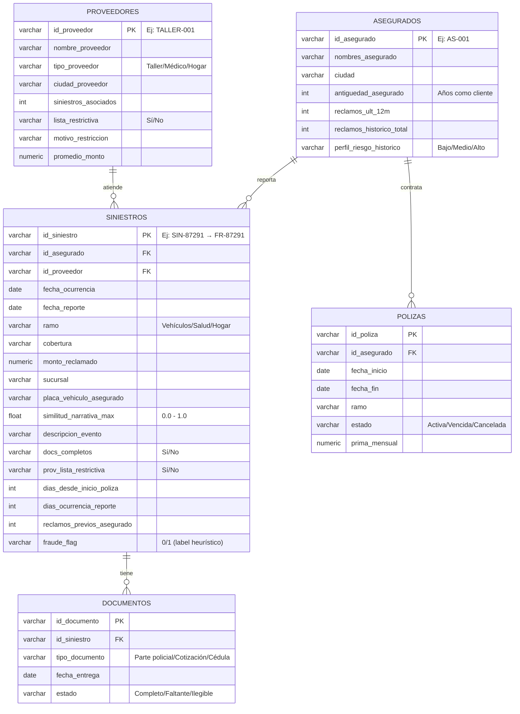

# Modelo de Datos — Fraudia

Este documento describe el esquema de la base de datos PostgreSQL del sistema Fraudia, con las 5 tablas principales y sus relaciones.

---

## Diagrama Entidad-Relación

---

## Descripción de Tablas

### `siniestros` (tabla central)
Registra cada evento de siniestro reportado. Es la tabla más importante del sistema. Incluye campos calculados durante la ingesta como `similitud_narrativa_max`, `dias_desde_inicio_poliza`, y `prov_lista_restrictiva`.

> **Nota**: Los IDs en base de datos usan el formato `SIN-XXXX`. La API los expone como `FR-XXXX` para coherencia con la interfaz.

### `asegurados`
Perfil del cliente asegurado. Incluye métricas de comportamiento histórico como `reclamos_ult_12m` y `perfil_riesgo_historico`.

### `proveedores`
Talleres, clínicas, y prestadores de servicio. El campo `lista_restrictiva` y `motivo_restriccion` son clave para el scoring de fraude.

### `documentos`
Soporte documental de cada siniestro. La ausencia de documentos obligatorios activa la señal `docs_completos = 'No'` en la tabla `siniestros`.

### `polizas`
Contrato de seguro del asegurado. Permite calcular `dias_desde_inicio_poliza` al cruzar con la fecha de ocurrencia del siniestro.

---

## Relaciones Clave

| Relación | Cardinalidad | Propósito |
|----------|-------------|-----------|
| `asegurados` → `siniestros` | 1:N | Un asegurado puede tener múltiples siniestros |
| `proveedores` → `siniestros` | 1:N | Un proveedor puede atender múltiples siniestros |
| `siniestros` → `documentos` | 1:N | Un siniestro puede tener múltiples documentos |
| `asegurados` → `polizas` | 1:N | Un asegurado puede tener múltiples pólizas |

---

## Campos Derivados y Calculados

| Campo | Tabla | Cálculo |
|-------|-------|---------|
| `similitud_narrativa_max` | siniestros | TF-IDF cosine similarity contra corpus histórico (pre-calculado en pipeline) |
| `dias_desde_inicio_poliza` | siniestros | `fecha_ocurrencia - poliza.fecha_inicio` |
| `dias_ocurrencia_reporte` | siniestros | `fecha_reporte - fecha_ocurrencia` |
| `prov_lista_restrictiva` | siniestros | Lookup en tabla `proveedores.lista_restrictiva` |
| `score_compuesto` | (calculado en API) | Ver fórmula en `docs/reglas_negocio.md` |

---

*Última actualización: Mayo 2026 — Fraudia v1.0*
